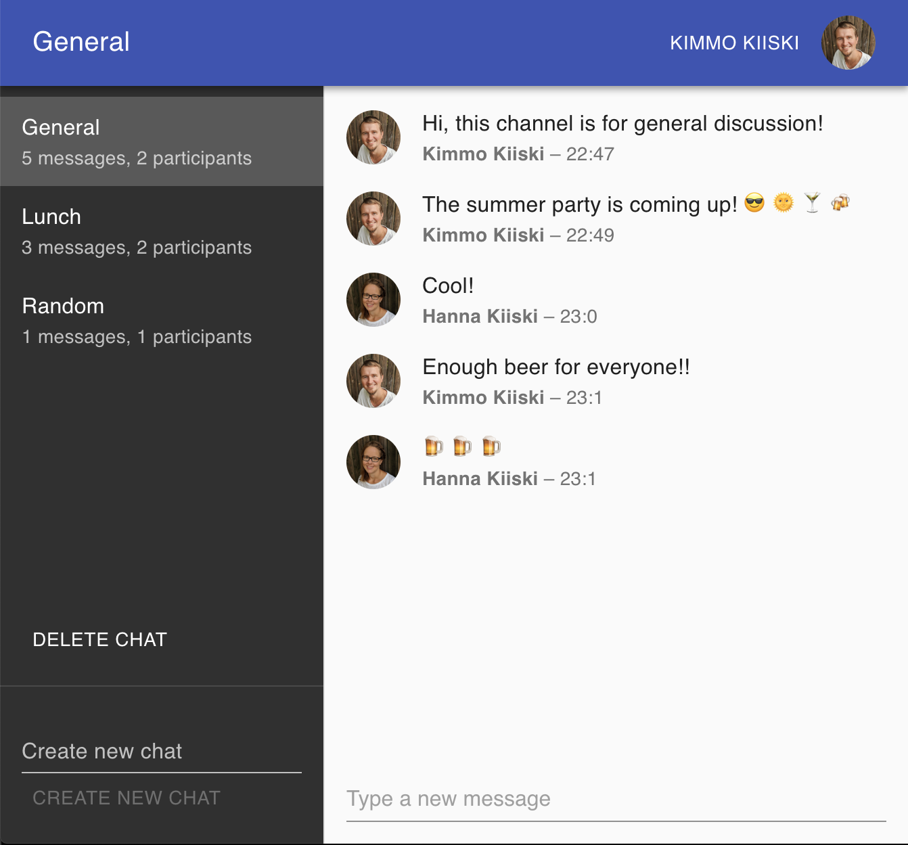

# Example Firebase chat web app

**Demo available at: https://kiiski-chat.firebaseapp.com/**

This project is a working proof-of-concept of a chat web application build on top of the Firebase.

It includes the following features:

- **Serverless** hosting on **[Firebase](https://firebase.google.com/)**
- UI build with **React**, **Firebase SDK**, and **[Material UI](https://material-ui.com/)**
- Both frontend and backend written with **Typescript**
- **User authentication** with a Google account
- **Real-time** changes provided by Firestore SDK
- Example **security rules** to protect the database
- Scripts for running locally and deploying

**This motivation of this project was to learn Firebase. It is not meant for actual production use.**

This project was bootstrapped with [Create React App](https://github.com/facebook/create-react-app).

## Development

In the project directory, you can run:

### `npm install`

Install required dependencies in order to run, develop and deploy the app.

### `npm start`

Runs the app in the development mode. 
Open [http://localhost:3000](http://localhost:3000) to view it in the browser.

The page will reload if you make edits. 
You will also see any lint errors in the console.

It will also automatically run the local Firebase hosting service.

### `npm run deploy`

Deploys the production ready app to be hosted on Firebase.

### `npm run build`

Builds the app for production to the `build` folder. 
It correctly bundles React in production mode and optimizes the build for the best performance.

The build is minified and the filenames include the hashes. 
Your app is ready to be deployed!

See the section about [deployment](https://facebook.github.io/create-react-app/docs/deployment) for more information.
